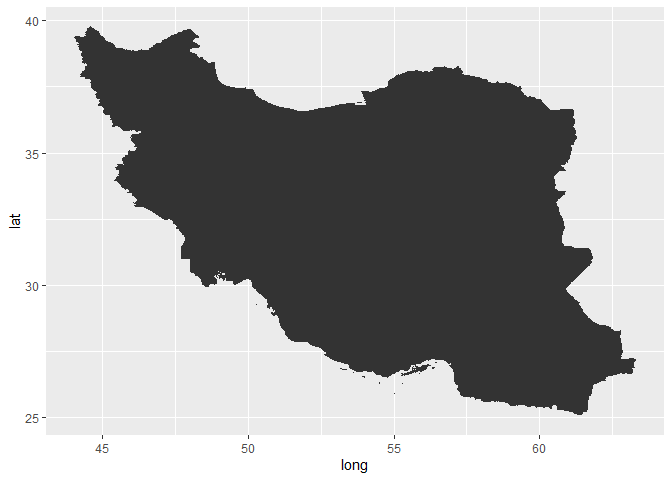

<!-- README.md is generated from README.Rmd. Please edit that file -->

# MohammadLab3

<!-- badges: start -->
<!-- badges: end -->

The goal of MohammadLab3 is to create a tidy data frame of geographical
information such as longitude, latitude, order and group from a shape
file.

## Installation

You can install the development version of MohammadLab3 from
[GitHub](https://github.com/) with:

``` r
# install.packages("devtools")
devtools::install_github("m-fili/Stat585-Lab3")
```

## Example

This is a basic example which shows you how to use the functions in this
package to create a data frame from a shape file.

``` r
library(MohammadLab3)
#> Registered S3 method overwritten by 'geojsonlint':
#>   method         from 
#>   print.location dplyr
library(ggplot2)
library(dplyr)
#> 
#> Attaching package: 'dplyr'
#> The following objects are masked from 'package:stats':
#> 
#>     filter, lag
#> The following objects are masked from 'package:base':
#> 
#>     intersect, setdiff, setequal, union

# Loading the shape file for Iran
data("Iran")

# Class of the object Iran
'sf' %in% class(Iran)
#> [1] TRUE

# Creating the data frame from an sf file
iran_df <- team_2(Iran, tolerance = 0.1)

# Visualize
iran_df %>% 
  ggplot(aes(x = long, y = lat, group = group)) + 
  geom_polygon()
```


